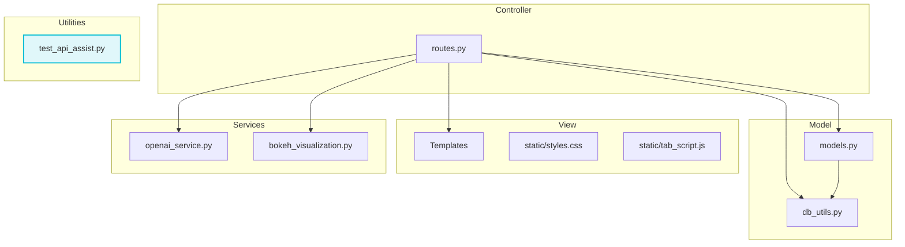

# **Architecture description**

## Structure

The architecture of this application follows the Model-View-Controller (MVC) pattern with additional service and utility layers. The **Model** represents the core business logic and data handling, with components such as `models.py` and `db_utils.py` to manage data interactions. The **View** layer includes the HTML templates and static assets like CSS and JavaScript to render the UI. The **Controller** manages application routes, defined in `routes.py`, that connect user input to the appropriate business logic. 

In addition to the core MVC structure, the application integrates external services, such as OpenAI and Bokeh, for AI processing and data visualization. The **Utilities** layer provides auxiliary functions like API testing. This modular architecture ensures the separation of concerns, making the application more maintainable and scalable.

## User Interface

The application provides several user interface views, each serving a distinct purpose in the system. The UI is composed of five main templates:

1. **index.html** – The main landing page of the application. This template contains a text input field, allowing the user to type, submit, and fine-tune a business idea. 
   
2. **previous_projects.html** – A page that displays a list of previous projects. It includes an option to edit individual projects.

3. **update_project.html** – A form or interface for updating existing project information. This template allows users to modify details about a project to iteratively enhance assessment scores.

4. **visualization.html** – A page dedicated to visualizing projects on scatter plots. 

Each template is designed to allow seamless user interactions, with navigation elements provided via `layout.html` and content-specific functionality managed through the other templates. The user interface is clean and modular, ensuring an efficient and user-friendly experience across all pages.

## **Logic**

The logic of the application is primarily handled by various route handlers defined in `routes.py`, which interact with both the database and external services like OpenAI to process and manage project data. 

### Key Logic Examples:

1. **chat_project()** (`/process_project` route):
   - This function is responsible for processing a new project by generating a thread with OpenAI, sending the project description to be evaluated, and then retrieving the assistant’s response. It handles both creating new projects and updating existing ones by utilizing methods like `create_thread()` and `messages.create()`. 

2. **evaluate_project()** (`/evaluate_project` route):
   - This method evaluates a project using OpenAI’s evaluation service. Once the evaluation is complete, it updates the project’s properties like `x_value`, `y_value`, and `impact` in the database. It makes use of the `evaluate()` function in the `IdeaGenerator` class.

3. **update_project()** (`/update_project` route):
   - Handles both displaying and updating project details. The `GET` method retrieves project data, while the `POST` method allows modification of project descriptions and other attributes.

These examples illustrate how the application handles various project-related operations, such as processing user input, interacting with OpenAI for AI-based evaluations, and updating the database using SQLAlchemy ORM.

